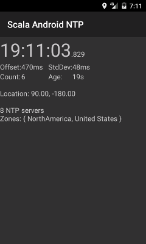

# Scala Android NTP (santp)

santp is a simple
[Android](https://developer.android.com/index.html) application
for obtaining accurate wall-clock time
using the Network Time Protocol
([NTP](https://en.wikipedia.org/wiki/Network_Time_Protocol)).
This allows a mobile phone to estimate the offset between
the system time and a set of NTP time servers,
producing a real-time on-screen display of the corrected time.
The application will automatically select a set of NTP servers
based on the approximate location of the phone,
and a built-in list of NTP servers for a selection
of geographical regions.
When GPS is available, the application will also use
timing information from GPS, combining all available
time-reference information using a statistical model
similar to a Kalman Filter.

The package is written in Scala,
and built using [SBT](http://www.scala-sbt.org/), together with
the [sbt-android](https://github.com/scala-android/sbt-android) plugin.
It makes use of the
[Apache Commons Net](https://commons.apache.org/proper/commons-net/) library,
and the [Akka](http://akka.io/) toolkit.
